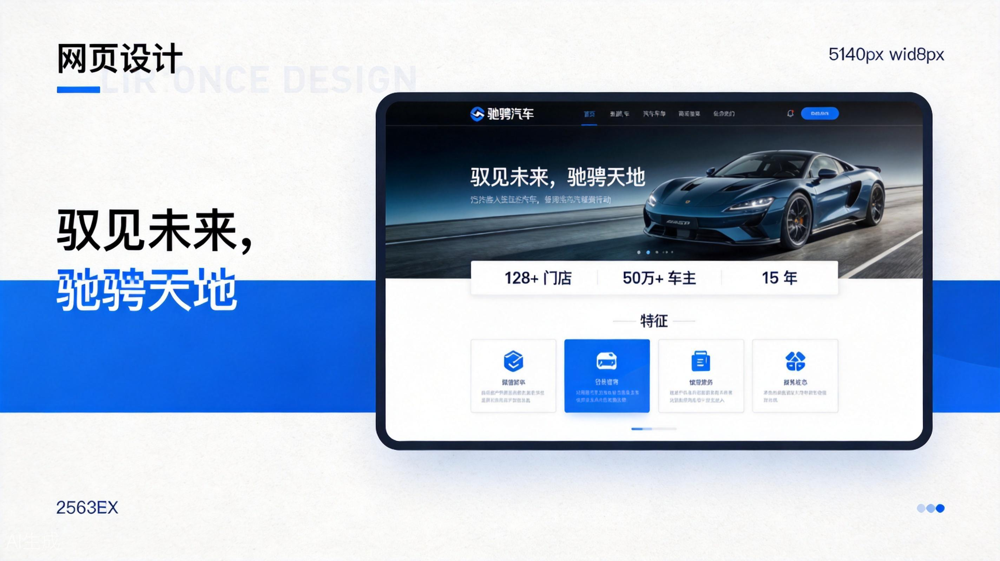
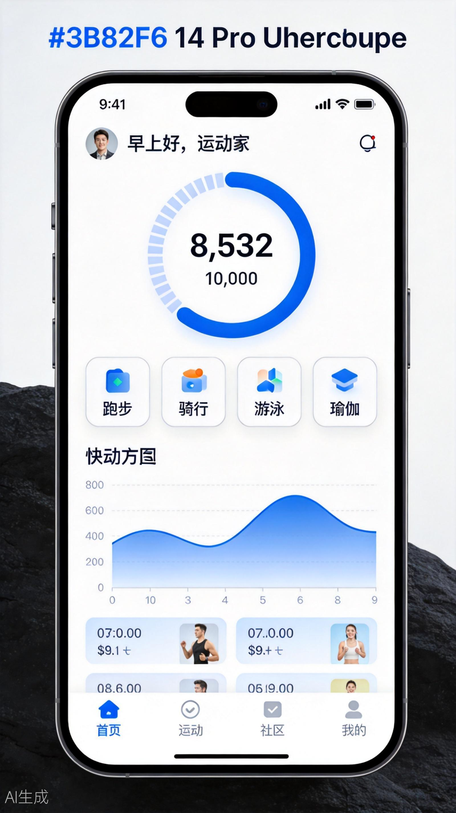

# AIForge 前端设计原型大横评

<div align="center">

**AIForge Frontend Design Prototype Showcase**

[](https://z5511023.github.io/aiforge-showcase/)
[](https://github.com/z5511023/aiforge-showcase)


</div>

---

<details open>
<summary><b>🇨🇳 中文 / Chinese</b></summary>

## 项目简介

AIForge 是一个 **AI 大模型前端设计能力对比展示平台**，通过对同一类型产品的不同 AI 模型设计输出进行横向对比，帮助开发者和设计师直观了解各模型在前端设计方面的风格差异与能力表现。

项目采用 **2v2v2 对比结构**，涵盖 3 种产品类型（官网 / APP / 后台），共 6 个可交互原型。

## 在线预览

🔗 **[点击访问在线演示](https://z5511023.github.io/aiforge-showcase/)**

## 项目结构

本项目包含 **6 个完整可交互原型**，分为 3 组对比：

### 官网原型对比

| 原型 | 模型 | 风格特点 | 配色方案 |
|------|------|---------|---------|
| 驰骋汽车官网 | KIMI | 白蓝渐变、大图展示、现代企业风 | 白色 + 蓝色渐变 |
| 知识科普网站 | Mimo | 暗黑金色、沉浸式阅读、高端质感 | 深色底 + 金色强调 |

### APP 原型对比

| 原型 | 模型 | 风格特点 | 配色方案 |
|------|------|---------|---------|
| 运动健身 APP | KIMI | 白色清爽、数据可视化、步数圆环 | 白色底 + 蓝色强调 |
| 饮食健康 APP | ChatGPT | 深色主题、卡路里追踪、饮水记录 | 深绿底 + 绿色强调 |

### 后台原型对比

| 原型 | 模型 | 风格特点 | 配色方案 |
|------|------|---------|---------|
| 电商运营后台 | KIMI | 深色侧边栏、KPI 看板、订单管理 | 白底 + 深色侧栏 |
| 智慧工地后台 | Gemini | 工程进度、甘特图、设备监控 | 浅灰底 + 蓝色强调 |

## 功能特性

-  **6 个完整可交互原型** — 每个原型都是独立的可点击、可浏览的完整页面
-  **筛选系统** — 支持按 AI 模型（KIMI / Mimo / ChatGPT / Gemini）和产品类型（官网 / APP / 后台）双重筛选
-  **风格对比展示** — 同类型产品不同模型的设计差异一目了然
-  **响应式布局** — 完美适配桌面端、平板和手机
-  **真实数据模拟** — 每个原型都包含真实的业务数据和交互元素

## 技术栈

- **React 18** + **TypeScript** — 核心框架
- **Vite** — 构建工具
- **Tailwind CSS** — 样式方案
- **shadcn/ui** — UI 组件库
- **Lucide React** — 图标库
- **React Router** — 页面路由（HashRouter 适配静态部署）

## 本地运行

```bash
# 克隆仓库
git clone https://github.com/z5511023/aiforge-showcase.git

# 进入项目目录
cd aiforge-showcase

# 安装依赖
npm install

# 启动开发服务器
npm run dev

# 构建生产版本
npm run build
```

## 项目目录

```
app/
├── src/
│   ├── pages/
│   │   ├── Home.tsx                    # 首页展厅（筛选 + 卡片列表）
│   │   └── detail/                    # 6 个原型详情页
│   │       ├── WebsiteCarDetail.tsx        # 驰骋汽车官网（KIMI）
│   │       ├── WebsiteKnowledgeDetail.tsx  # 知识科普网站（Mimo）
│   │       ├── AppSportsDetail.tsx         # 运动健身 APP（KIMI）
│   │       ├── AppDietDetail.tsx           # 饮食健康 APP（ChatGPT）
│   │       ├── AdminEcommerceDetail.tsx    # 电商运营后台（KIMI）
│   │       └── AdminEngineeringDetail.tsx  # 智慧工地后台（Gemini）
│   ├── App.tsx                        # 路由配置
│   └── main.tsx                       # 入口文件（HashRouter）
├── public/prototypes/                 # 6 张原型封面截图
└── package.json
```

## 模型标签说明

| 标签 | 颜色 | 说明 |
|------|------|------|
| **KIMI** | 🔵 蓝色 | 3 个原型：汽车官网、运动 APP、电商后台 |
| **Mimo** | 🟣 紫色 | 1 个原型：知识科普网站 |
| **ChatGPT** | 🟢 绿色 | 1 个原型：饮食健康 APP |
| **Gemini** | 🟠 橙色 | 1 个原型：智慧工地后台 |

## 部署方式

本项目使用 **GitHub Actions** 自动部署到 **GitHub Pages**：

1. 推送代码到 `main` 分支
2. GitHub Actions 自动执行 `npm run build`
3. `dist/` 文件夹自动部署到 Pages
4. 访问 `https://你的用户名.github.io/仓库名`

</details>

---

<details>
<summary><b>🇺🇸 English</b></summary>

## Introduction

AIForge is an **AI model frontend design capability comparison platform**. It presents a horizontal comparison of different AI models' design outputs for the same product type, helping developers and designers intuitively understand the style differences and capabilities of each model in frontend design.

The project adopts a **2v2v2 comparison structure**, covering 3 product types (Website / APP / Admin), with 6 interactive prototypes in total.

## Live Preview

🔗 **[Click to view live demo](https://z5511023.github.io/aiforge-showcase/)**

## Project Structure

This project contains **6 complete interactive prototypes**, divided into 3 comparison groups:

### Website Prototype Comparison

| Prototype | Model | Style Features | Color Scheme |
|-----------|-------|---------------|--------------|
| ChiCheng Auto Website | KIMI | White-blue gradient, large image, modern enterprise | White + Blue gradient |
| Knowledge Portal | Mimo | Dark gold theme, immersive reading, premium feel | Dark bg + Gold accent |

### APP Prototype Comparison

| Prototype | Model | Style Features | Color Scheme |
|-----------|-------|---------------|--------------|
| Sports Fitness APP | KIMI | Clean white, data visualization, step ring | White bg + Blue accent |
| Diet Health APP | ChatGPT | Dark theme, calorie tracking, water log | Dark green bg + Green accent |

### Admin Dashboard Comparison

| Prototype | Model | Style Features | Color Scheme |
|-----------|-------|---------------|--------------|
| E-commerce Admin | KIMI | Dark sidebar, KPI dashboard, order management | White bg + Dark sidebar |
| Smart Construction Admin | Gemini | Project progress, Gantt chart, equipment monitor | Light gray bg + Blue accent |

## Features

-  **6 Complete Interactive Prototypes** — Each prototype is a standalone, clickable, browsable full page
-  **Filter System** — Filter by AI model (KIMI / Mimo / ChatGPT / Gemini) and product type (Website / APP / Admin)
-  **Style Comparison** — See design differences between models for the same product type at a glance
-  **Responsive Layout** — Perfectly adapted for desktop, tablet, and mobile
-  **Realistic Data Simulation** — Each prototype includes realistic business data and interactive elements

## Tech Stack

- **React 18** + **TypeScript** — Core framework
- **Vite** — Build tool
- **Tailwind CSS** — Styling
- **shadcn/ui** — UI component library
- **Lucide React** — Icon library
- **React Router** — Page routing (HashRouter for static deployment)

## Local Development

```bash
# Clone repository
git clone https://github.com/z5511023/aiforge-showcase.git

# Enter project directory
cd aiforge-showcase

# Install dependencies
npm install

# Start development server
npm run dev

# Build for production
npm run build
```

## Project Directory

```
app/
├── src/
│   ├── pages/
│   │   ├── Home.tsx                    # Homepage (filter + card grid)
│   │   └── detail/                    # 6 prototype detail pages
│   │       ├── WebsiteCarDetail.tsx        # ChiCheng Auto Website (KIMI)
│   │       ├── WebsiteKnowledgeDetail.tsx  # Knowledge Portal (Mimo)
│   │       ├── AppSportsDetail.tsx         # Sports Fitness APP (KIMI)
│   │       ├── AppDietDetail.tsx           # Diet Health APP (ChatGPT)
│   │       ├── AdminEcommerceDetail.tsx    # E-commerce Admin (KIMI)
│   │       └── AdminEngineeringDetail.tsx  # Smart Construction Admin (Gemini)
│   ├── App.tsx                        # Route configuration
│   └── main.tsx                       # Entry file (HashRouter)
├── public/prototypes/                 # 6 prototype cover screenshots
└── package.json
```

## Model Labels

| Label | Color | Description |
|-------|-------|-------------|
| **KIMI** | 🔵 Blue | 3 prototypes: Auto Website, Sports APP, E-commerce Admin |
| **Mimo** | 🟣 Purple | 1 prototype: Knowledge Portal |
| **ChatGPT** | 🟢 Green | 1 prototype: Diet Health APP |
| **Gemini** | 🟠 Orange | 1 prototype: Smart Construction Admin |

## Deployment

This project uses **GitHub Actions** for automatic deployment to **GitHub Pages**:

1. Push code to `main` branch
2. GitHub Actions automatically runs `npm run build`
3. The `dist/` folder is automatically deployed to Pages
4. Access at `https://your-username.github.io/repository-name`

</details>

---

## 截图 / Screenshots

<div align="center">

**首页展厅 / Homepage**





**原型详情页 / Prototype Detail Pages**

| 官网 / Website | APP | 后台 / Admin |
|:---:|:---:|:---:|
| 白蓝渐变 / 暗黑金色 | 清爽白色 / 深绿黑色 | 深色侧栏 / 浅灰蓝调 |

</div>

---

## Star History

如果这个项目对你有帮助，请给个 ⭐ Star！

If this project helps you, please give it a ⭐ Star!

---

<div align="center">

**Made with ❤️ by AIForge**

</div>
